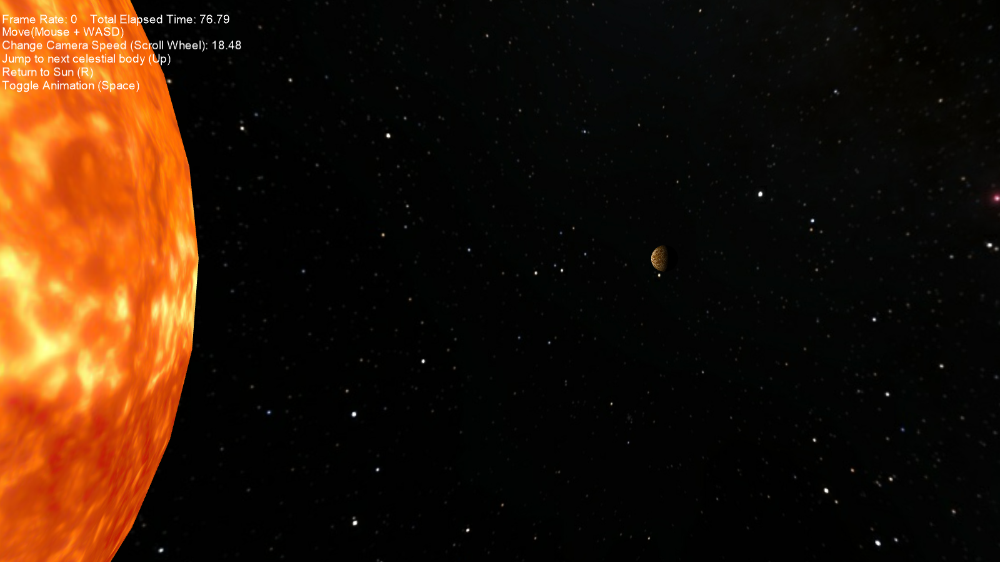
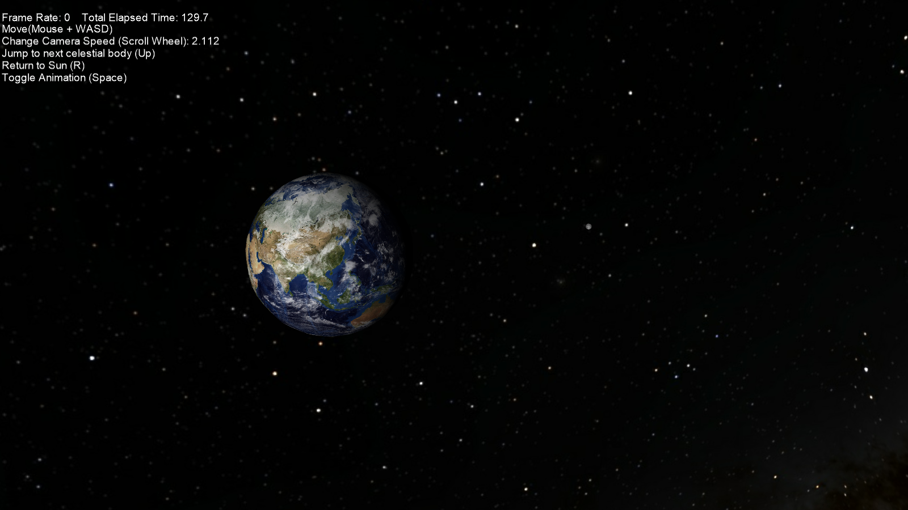
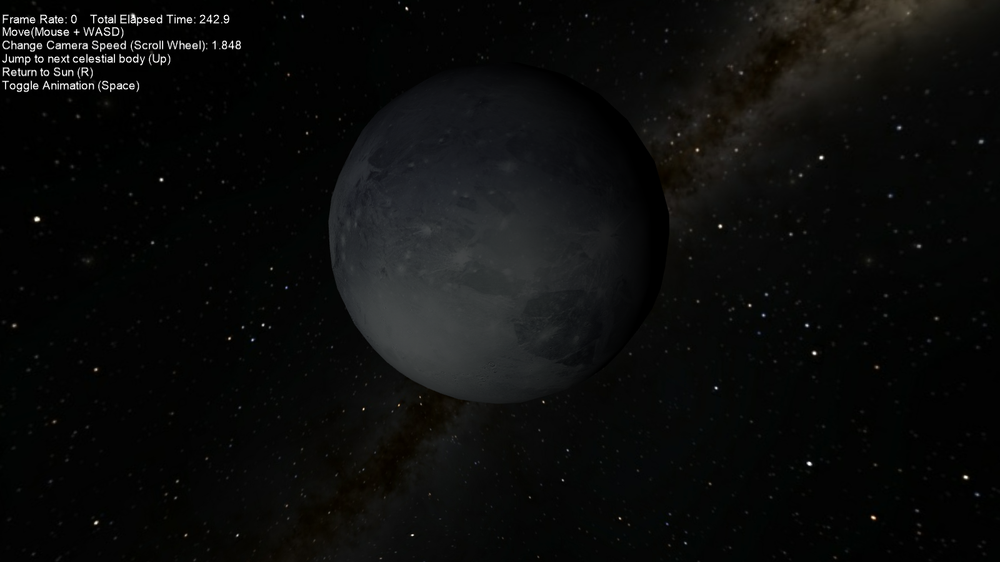

# SolarSystemModel

This project was created to learn the basics of graphics programming and how to apply matrix mathematics to obtain movements of the planets.
I created a model of our Solar System with the the sun, the 8 planets, Pluto and some select moons. I used a framework to help start the project, created by Dr. Paul Varcholik at https://bitbucket.org/pvarcholik/bespoke.games.framework

  

All the celestial bodies are lit by point lighting provided by the sun. The sun itself is unlit, since the point-light resides within the bounds of its mesh. I had to scale down the distances between the planets and their moons so that the model can be observed much more comfortably. I have used Space Engine (http://spaceengine.org/) to obtain the skybox texture I have used. One thing of note: I have not yet added the rings of Saturn (or Uranus or Neptune), since obtaining the mesh for those seems to be a much more difficult task.
All celestial bodies use the DirectX math library to apply transformation matrices to facilitate their movement.

## In the project I learnt how to
- write a simple vertex shader to render a mesh; in this case, the spheres of the bodies.
- write a pixel shader to apply textures to meshes.
- write a shader for point lighting using the cosine rule.
- apply rotation, translation and scaling to bodies in real-time.

### To browse the project, here's a key:
- The build folder contains the Visual Studio solution file. The projects are using the VS 2017 toolset (v141), currently, but they can be changed to VS 2015 (v140) toolset too.
- The exec folder contains an executable for the project.
- screens folder has screenshots of the program running.
- source folder has the Visual Studio project files and the source code.
- Lastly, the content folder has the mesh and the textures used for the project.
